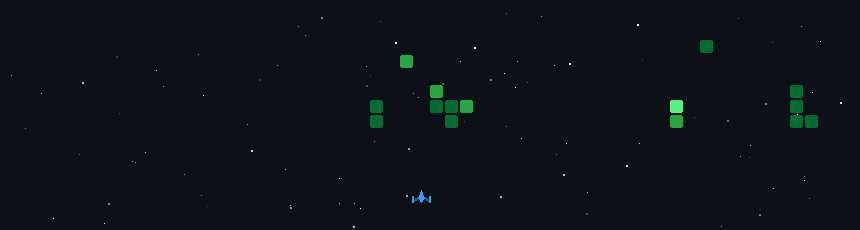

<h1>Hi there, I'm Siddhi 👋</h1>

  

 

<h2 align="center">👨‍💻 About Me</h2>

Computer Science undergraduate passionate about **backend engineering, full-stack development, and AI applications** — I enjoy the deeper systems side of building software that actually solves problems.

- 💻 Full-stack developer building scalable applications using **FastAPI, Node.js, Express.js, React.js, MongoDB, and MySQL**
- 🤖 Built **Retrieval-Augmented Generation (RAG)** applications using **OpenAI API, ChromaDB, Sentence Transformers, embeddings, and semantic search**
- ⚙️ Experienced in developing secure backend services — REST APIs, JWT authentication, role-based authorization, schema design, and validation
- 🧠 Skilled in designing AI pipelines — code chunking, repository indexing, vector databases, and context-aware LLM applications
- 📚 Strong problem-solving skills backed by **Data Structures & Algorithms** and solid CS fundamentals in **Object-Oriented Programming, DBMS, Operating Systems, and Computer Networks**
- 📫 Reach me at **[siddhivarma05@gmail.com](mailto:siddhivarma05@gmail.com)**

 

 

<h2 align="center">🧰 Tech Stack & Tools</h2>

<h4>⌨️ Languages</h4>

<h4>🌐 Web Development</h4>

<h4>🗄️ Databases & Vector Search</h4>

<h4>🤖 AI / ML & Backend</h4>

<h4>🛠️ Tools & Platforms</h4>

 

  

 

✨ <i>Thanks for stopping by — always up for discussing DSA, MERN, or AI/RAG systems!</i> ✨

